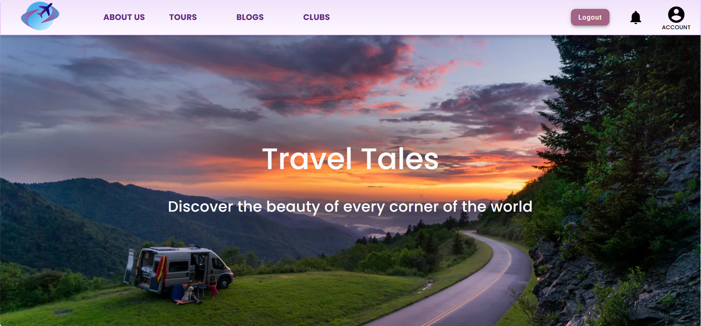
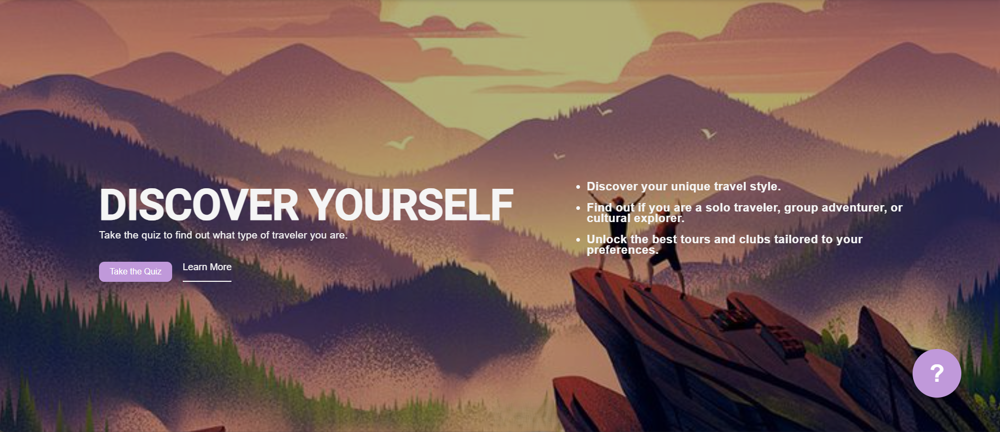
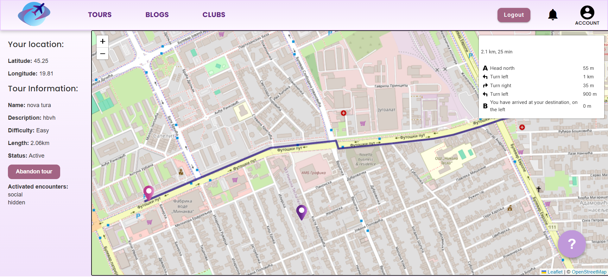
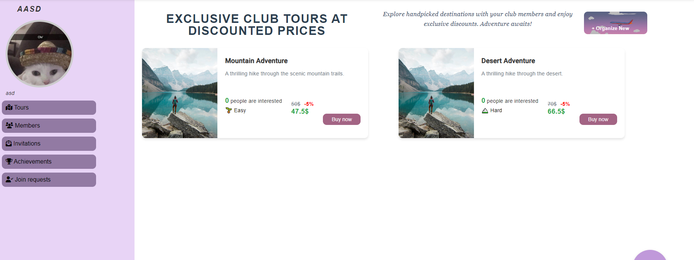
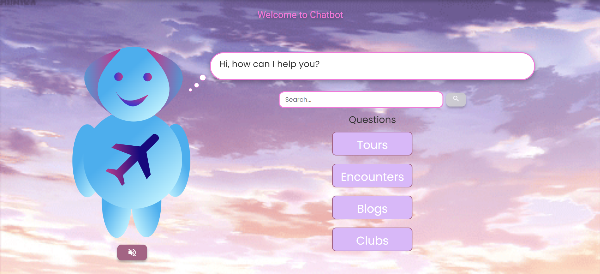

# Travel Tales Backend

Academic project for Software Design course, Faculty of Technical Sciences, University of Novi Sad

## About Project

Travel Tales is a feature-rich web application developed using ASP.NET Core, PostgreSQL, Entity Framework, AutoMapper, and tested using xUnit. The platform supports three user roles: admin, tourists, and tour creators, offering a rich set of features designed to enhance digital travel experiences.

✨ Key Features:

► Browse and purchase individual or bundled tours

► Get personalized recommendations through an interactive quiz

► View tours on an interactive map with audio/text at key points

► Complete in-tour encounters and challenges to earn XP and unlock rewards

► Write and explore blogs with comments, voting, and filtering

► Join or create clubs to connect with like-minded travelers

► Create and manage tours with routes, key points, and equipment lists

► Customize tours with discounts, coupons, and media-rich content

► Built-in chatbot for quick help and recommendations

...and much more.

Special attention was given to writing clean, maintainable, and scalable code, following best practices and design principles.

## Used Tools
► Microsoft Visual Studio 
► Visual Studio Code 
► PostgreSQL 

### Authors
The project was developed by a 16-member team using the Agile methodology, with regular sprints, planning sessions, and retrospectives to ensure continuous improvement and collaboration.

## Screenshots

