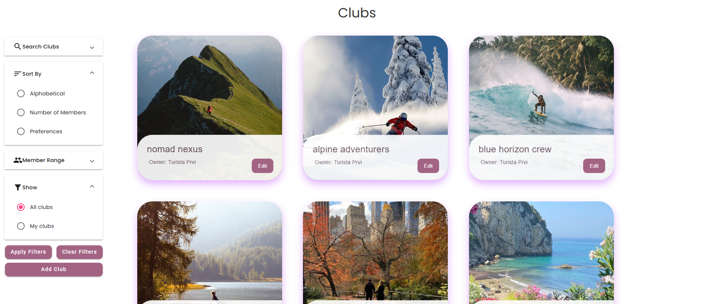

# Travel Tales Backend

Academic project for Software Design course, Faculty of Technical Sciences, University of Novi Sad

## About Project

Travel Tales is a feature-rich web application developed using ASP.NET Core, PostgreSQL, Entity Framework, AutoMapper, and xUnit for testing. The platform supports three user roles: admin, tourists, and tour creators.

Key features include:

►  Creation and customization of tours

►  Writing and reading travel blogs

►  Creation and customization of clubs

►  Interactive virtual tours via a map interface

►  Purchasing individual tours or bundled packages

►  Dynamic modification of tour key points

►  Built-in chatbot for enhanced user interaction

►  An interactive quiz that suggests personalized tour recommendations based on user preferences

► Encounters during tours that users can complete to earn XP and unlock various benefits and rewards

...and much more.

Special attention was given to writing clean, maintainable, and scalable code, following best practices and design principles.

## Used Tools
► Microsoft Visual Studio 
► Visual Studio Code 
► PostgreSQL 

### Authors
The project was developed by a 16-member team using the Agile methodology, with regular sprints, planning sessions, and retrospectives to ensure continuous improvement and collaboration.

## Screenshots

